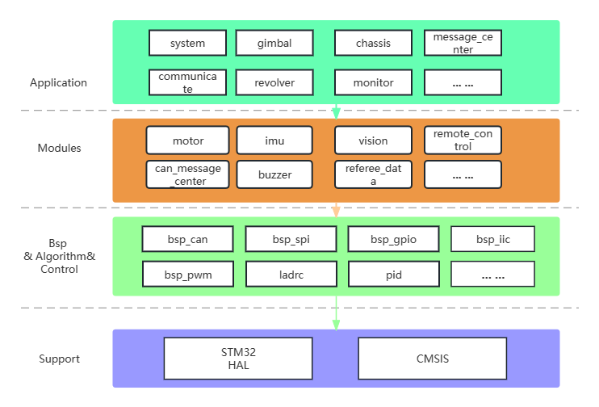
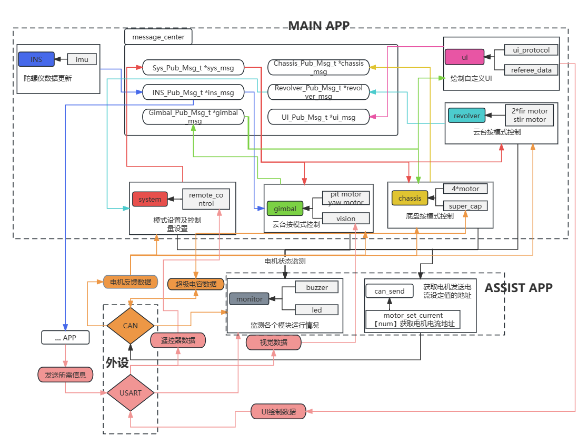

# basic_framework

## 介绍
沈阳航空航天大学T-UP战队2024赛季电控统一新框架

### 起源
在23赛季我们就曾使用C语言和C++混编开发过一套全新框架。由于当时个人水平有限，完成的代码虽在代码量上有大幅减少，可读性增加并进行了一些封装，在一定程度上帮助了我们的工程开发与协作，但并未达到预期效果。其框架顶层的各个任务之间耦合性依旧很强，代码的复用性不高，类的封装也并未体现面向对象的特点。故在新赛季初，便开始了新框架basic_framework的编写。

此套新代码框架层级分明较为清晰，各个对象封装较好，代码复用性高，耦合程度低，其较高的可扩展性相比之前有较大提升，有助于后续的研发和扩展。

## 软件设计
### 软件架构说明

### 设计思想
**总览**  
此套代码使用了C与C++进行混编，通过C++的特性进行类的封装。  

结构上分为**Bsp/Module/App**三层。这三种层级分别具备不同的作用，顶层的类需要包含使用底层的类。最顶层的App层级中，每个应用之间有信息交互需求的，通过类似于pub-sub的消息机制，在初始化时使用指针读取所需结构体的实例地址进行解耦，使各个应用的任务不会出现互相包含的情况，各个不同的应用只需要包含同一个message_center即可实现信息的交互。

**Bsp层**内文件为板级支持包，在其中我们封装了各类HAL库的函数，与HAL库耦合，若需移植到其他开发板上，无需更改Bsp层。在bsp_usart中我们通过预编译，对不同开发板的串口直接进行了不同的定义（仅针对Robomaser开发板C型和A型），其余开发板若有不同需更改。

在bsp_can中，我们为了提高开发效率，使用了注册登记表的形式，当有新的CAN线设备注册时，无需再在CAN接收回调函数中进行改动代码。

**Algorithm和Control**包含了各种算法以及pid、ladrc和滤波器的文件，供Module层及调用。

**Module层**即模块层，在此层内包括了真实硬件模组以及各个信息模块，如电机（类内封装了控制器）、imu、remote_control(遥控器)、referee_data（读取裁判系统数据）、UI绘制基础协议、buzeer、led等等模块。

我们对电机着重进行了封装，将**控制器**选择封装在电机类内，在有需求增加新电机时可快速进行添加，无需在多个地方进行更改，有需求添加新控制器时对电机类扩展也较为便捷；同时也对其进行了**控制器是否初始化**和**电机温度**的监测，可在代码编写以及程序正常运行时对电机状态进行**可视化**呈现，由于是通过**回调函数**进行实现，后续如有对电机其他指标进行监测的需求也可**快速扩展**。

**App层**即应用层，为框架层级中最高的部分。在此层内有各种app任务运行在FreeRTOS中,所有的任务安排都放在task_center中，可快速更改各个任务的控制频率。此层内已封装了system、gimbal、chassis、revolver、message_center、communicate、monitor、draw_ui等任务。目前的内容仅为示例，可根据自行需求进行添加。

### 监测任务说明
监测任务主要使用的外设为**蜂鸣器**以及**LED**，使用此两种外设可对整个程序运行状态进行**可视化**的监测，蜂鸣器和LED的封装较为良好，在LED中封装了各种闪烁类型，其配合DWT外设的使用，额外添加监测的部分以不同灯效展示运行状态较为便捷，有新程序内容需要进行监测时仅需多调用**一个函数**即可实现。

### def文件说明
board_def.h：开发板类型、数量及位置的定义处（**在Bsp层中**）  
operation_def.h：操作定义处，包括灵敏度、最大速度等（**在App层中**）  
robot_def.h：机器人各种属性的定义（**在App层中**）

这些def文件主要为**宏定义**，我们通过def文件，对程序广泛使用条件编译，可快速进行新机器人的移植，其中的宏定义可根据需求进行更改（开发板数量、类型、位置）。

### 信息交互中心创建新信息结构体说明及示例
目前类message_center_t的实例为各类信息交互的中心，所有需要多个App间进行信息交互的数据均在**message_center.h**中的对应结构体中定义，message_center_t类中需创建**此结构体类型的指针**，该结构体的实例则建立在这些数据的**主要应用处**，具体使用方法如下：  
* 例:如需增加一个任务ui.cpp，其与其他任务有信息交互的需求，其他处需用到ui.cpp中
信息。  
```
`message_center.h`
enum Msg_Type_e
{
	...
    ...
	UIPUB,
	//add_more
	
	TOTALNUM,
};

typedef struct
{
	fp32 ...;
    fp32 ...;
}UI_Pub_Msg_t;

class Message_Center_t
{
	public:
		//添加需初始化的结构体指针
		UI_Pub_Msg_t *ui_msg;
	
		//指针初始化
		void PointerInit(void *msg,Msg_Type_e type);
};
```

```
`message_center.cpp`
void Message_Center_t::PointerInit(void *msg,Msg_Type_e type)
{
	switch(type)
	{
		case UIPUB:
			ui_msg = (UI_Pub_Msg_t*)msg;
        case ...:
        case ...:
		case TOTALNUM:
			break;
	}
}
```

```
`draw_ui.cpp`
//UI初始化
void UiInit()
{
	message_center.PointerInit(&ui_msg,UIPUB);
}
```

```
`task_center.cpp`
void UiTask(void const *pvParameters)
{
	vTaskDelay(TASK_INIT_TIME);
	UiInit();//初始化
	while(1)
	{
	}
}
```
### 电机示例创建示例
* 例：在gimbal中建立一个yaw轴电机实例。
```
`gimbal.h`
class gimbal_t
{
    private:

    public：
        DJIMotorInstance yaw_motor; //新建实例
}；
```

```
`gimbal.cpp`
gimbal_t::gimbal_t()
{
    //电机初始化(电机类型、所挂CAN线号、设置电机ID、控制器类型)
    yaw_motor.DJIMotorInit(GM6020,ON_CAN1,1,LADRC_FDW_CONTROL);
    //控制器初始化
    yaw_motor.controller.ladrc_fdw.init(......);
}
```
### CAN使用说明
#### CAN线新添设备实例进行信息接收
在添加新的需挂载在CAN线上的设备时，仅需要两步即可实现，无需在接收中添加新的case。
正常需扩展增加设备挂载时，仅需在该设备的类中进行如下操作即可！！！
 
第一步：在需要的结构体或类中加入CAN_Rx_Instance_t*类和CAN_Rx_Init_t类。  
第二步：调用CANRxInitSet()函数对CAN_Rx_Init_t类进行初始化。  
第三步：调用CANRxRegister()函数进行注册登记和初始化设置。
 
* 特别注意：需定义一个static void Decode***(CAN_Rx_Instance_t *rx_instance)类型的
信息解码函数，并在CANRxInitSet()中作为形参传入
 
例：在motor类中，需将电机注册到CAN线中
```
`motor.h`
1.class DJIMotorInstance
{
 	public:
 		CAN_Rx_Instance_t *motor_can;				//电机CAN实例指针
 		CAN_Rx_Init_t motor_can_init;				//电机CAN实例初始化
}

`motor.cpp`
2.void DJIMotorInstance::DJIMotorInit()
{
 	CANRxInitSet(&motor_can_init,can_num,motor_rx_id,motor_address,DecodeDJIMotor);
 	motor_can = CANRxRegister(&motor_can_init);
}
```
#### CAN线信息发送
* 新添加电机设备需新的STDID时按如下格式进行添加
```
CANTxInstance_t CANTxInstance[] = 
{
	{&hcan1,{0x200,0,CAN_ID_STD,CAN_RTR_DATA,0x08},{NULL}},  //0
}
```

* 双板或者与超级电容等设备需要进行信息发送 
```
CANCommTxInstance_t CANCommuInstance[] = 
{
	//原紫色超电发送控制协议
	{&hcan1,{0x210,0,CAN_ID_STD,CAN_RTR_DATA,0x08},NULL,NULL,NULL},	 //0
	//双板通信
	{&hcan1,{0x301,0,CAN_ID_STD,CAN_RTR_DATA,0x08},NULL,NULL,NULL},	 //1
	{&hcan1,{0x1FF,0,CAN_ID_STD,CAN_RTR_DATA,0x08},NULL,NULL,NULL},	 //2
};
```

## 程序运行流程及其数据流

### 数据流
该图仅展示程序**主要内容**的数据流。  



## 开发工具

> 不管是黑猫白猫，能抓老鼠的就是好猫。

本框架主要使用较为传统的**CubeMX**和**keil5**进行程序开发，调试时使用**keil5内的仿真**和**jscope**。

## Q&A


## 后续计划
* 尝试使用现代化工具**VSCode**以及**Ozone**

## 致谢